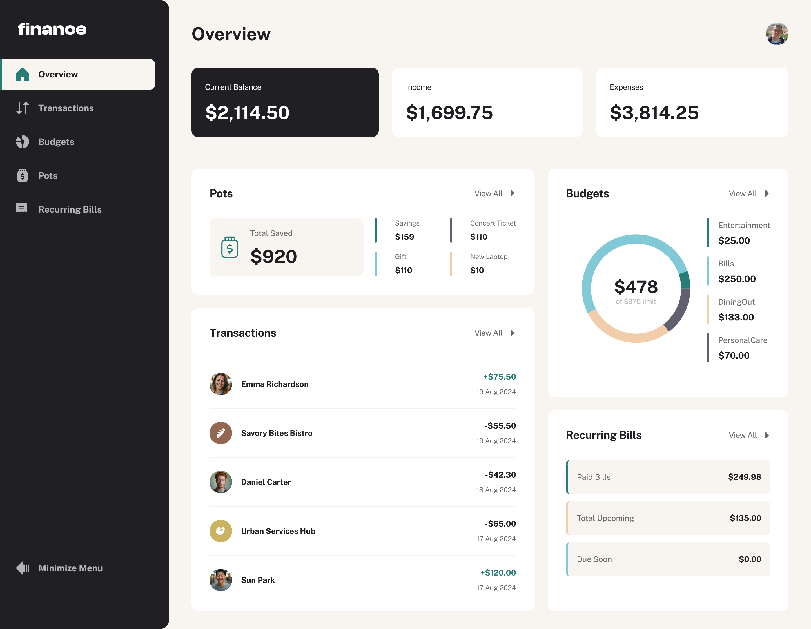

# Frontend Mentor - Personal Finance App Solution 💰📊

This is a solution to the [Personal finance app challenge on Frontend Mentor](https://www.frontendmentor.io/challenges/personal-finance-app-JfjtZgyMt1).  
Frontend Mentor challenges help me improve my coding skills by building realistic projects.

 
 
 
 
 
 

---

## Table of contents

- [Overview](#overview)
  - [The challenge](#the-challenge)
  - [Screenshot](#screenshot)
  - [Links](#links)
- [My process](#my-process)
  - [Built with](#built-with)
  - [What I learned](#what-i-learned)
- [Author](#author)

---

## Overview

### The challenge 🎯

Users should be able to:

- View all personal finance data at-a-glance on the overview page  
- See transactions with search, filter, sort, and pagination  
- Create, read, update, delete (CRUD) budgets and saving pots  
- View the latest three transactions for each budget category  
- Track progress towards each pot  
- Add or withdraw money from pots  
- Manage recurring bills and view monthly status  
- Receive validation messages for incomplete form fields  
- Navigate the app entirely using a keyboard  
- Responsive layouts for desktop, tablet, and mobile  
- Hover and focus states for all interactive elements  
- **Bonus:** Save details to a database  
- **Bonus:** User authentication (register/login)

---

### Screenshot 📸

  

---

### Links 🔗

- Solution URL: [Add solution URL here](https://your-solution-url.com)  
- Live Site URL: [Add live site URL here](https://your-live-site-url.com)

---

## My process 🛠️

### Built with 🏗️

**Frontend:**  
-  React  
-  Next.js  
-  Tailwind CSS + tailwind-merge + tailwindcss-animate  
-  Radix UI components (Popover, Dialog, Avatar, Progress, etc.)  
-  Recharts for charts & graphs  
-  React Hook Form + [Zod](https://zod.dev/) for validation  

**Backend / GraphQL:**  
-  Prisma ORM + PostgreSQL  
-  GraphQL Yoga + [Pothos](https://pothos-graphql.dev/)  
-  Apollo Client for data fetching  
-  Better Auth for authentication  
-  TypeScript for type safety  

---

### What I learned 📚

- Building a full-featured personal finance app with Next.js & React  
- Implementing CRUD operations for transactions, budgets, and pots  
- Creating a responsive sidebar for desktop, tablet, and mobile layouts  
- Integrating authentication and database with Prisma & Better Auth  
- Form validation and user notifications  

## Author

- Website - [Sergejs Ivcenko](https://sergejs-ivcenko.netlify.app)
- Frontend Mentor - [@Sergio0831](https://www.frontendmentor.io/profile/Sergio0831)
- GitHub - [Sergio0831](https://github.com/Sergio0831)
